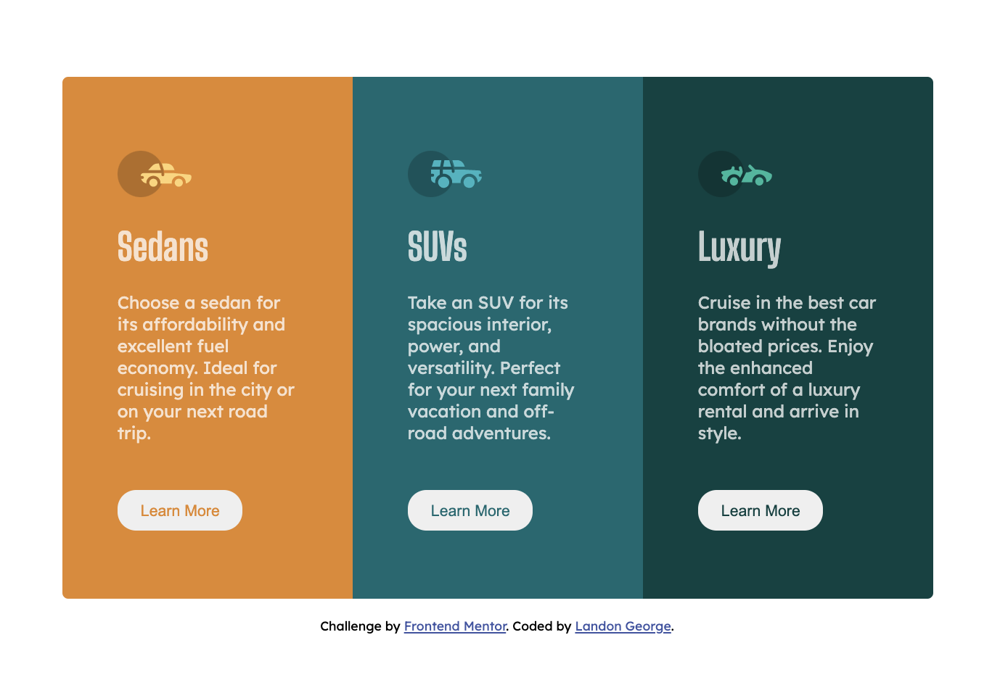

# Frontend Mentor - 3-column preview card component

This is a solution to
the [3-column preview card component challenge on Frontend Mentor](https://www.frontendmentor.io/challenges/3column-preview-card-component-pH92eAR2-)
.

## The challenge

Users should be able to:

- View the optimal layout depending on their device's screen size
- See hover states for interactive elements

## Screenshot

## Links
- [Solution](https://github.com/LandonRGeorge/fm-3-column-preview-card-component-main)
- [Live Site](https://landonrgeorge.github.io/fm-3-column-preview-card-component-main/)

## Built with

- HTML
- CSS (including Flexbox)
